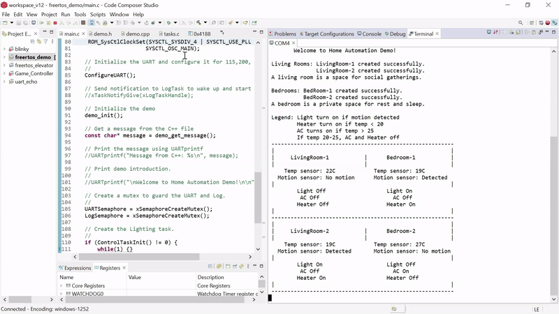

## OOP_HomeAutomation

This project is a Home Automation System designed for the TM4C123GXL microcontroller. It simulates a smart home environment with multiple rooms, each equipped with sensors and devices that can be controlled independently.

#### Key Features
- **Object Oriented Design:** Utilizes object-oriented principles to structure the system efficiently, enabling scalability and modularity.
- **C-compatibility wrapper:** Ensures seamless integration with C-based projects, making it adaptable for use with embedded systems frameworks like FreeRTOS.
- **FreeRTOS:** Leverages FreeRTOS for multitasking, ensuring real-time operation and efficient resource management for control of devices and sensors.
- **Simulation:** Simulates smart home operations with multiple rooms, each equipped with sensors and devices that are independently controlled.

#### OOP Design
**Class Design**
**1. `Room` Base Class**
- Represents a room in the home.
- Derived classes: `LivingRoom`, `BedRoom`.
**2. `Sensor` Base Class**
- Represents a sensor.
- Derived classes: `TempSensor`, `MotionDetector`.
**3. `Device` Base Class**
- Represents a device.
- Derived classes: `Light`, `AC`, `Heater`.

#### Demo
View the demo in action.  
